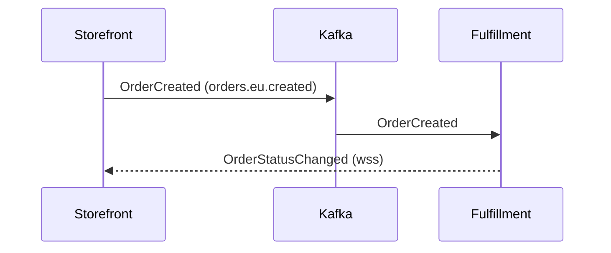

## Emphasis

**Bold**, _italic_, ~~strikethrough~~, `inline code`, E = mc^2^, and H~2~O.

## Code

A titled fence with line numbers and wrapped long lines (`markdown.code.wrap` is on in this sandbox):

```ts server.ts lineNumbers
import { createServer } from "node:http";

const server = createServer((request, response) => {
  response.end(
    "This is a deliberately long line to demonstrate soft wrapping inside code blocks when markdown.code.wrap is enabled."
  );
});

server.listen(3000);
```

A long `expandable` block, collapsed to its first lines until you open it:

```ts routes.ts lineNumbers expandable
import { defineRoutes } from "./router";

export default defineRoutes({
  home: "/",
  docs: "/docs",
  guides: "/docs/guides",
  layouts: "/docs/layouts",
  components: "/docs/components",
  islands: "/docs/islands",
  syntax: "/docs/syntax",
  reference: "/reference",
  changelog: "/changelog",
  blog: "/blog",
  pricing: "/pricing",
  status: "https://status.example.com",
  support: "mailto:support@example.com",
  privacy: "/legal/privacy",
  terms: "/legal/terms",
});
```

A package-install block:

```package-install
npm i blume
```

## Tables

| Feature  | Route     | Renderer |
| -------- | --------- | -------- |
| OpenAPI  | `/api`    | blume    |
| AsyncAPI | `/events` | blume    |

## Task lists

- [x] Check out PR #186
- [x] Create the sandbox app
- [ ] Kick the tires on every feature

## Math

$$
\int_0^\infty e^{-x^2}\,dx = \frac{\sqrt{\pi}}{2}
$$

Inline math sits in a sentence: a circle of radius $$r$$ has area $$\pi r^2$$.

## Mermaid



## Blockquote

> Documentation should be fast, AI-ready, and zero-config.
